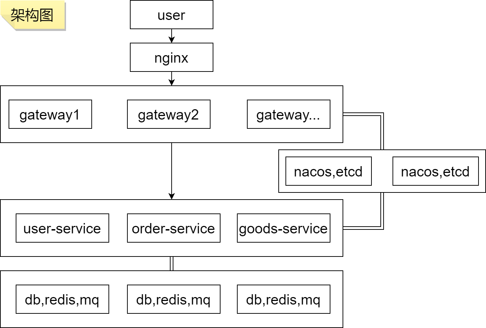

# PandaCloud

## 介绍

- 2023/3/27 -> 试验性项目

## 架构图

## 设计目标
- [ ] 网关
- [ ] 注册中心
- [ ] 服务
- [ ] 限流
- [ ] 熔断
- [ ] 降级

## 演示

- 启动 examples 目录下的服务
- api & service 目录下的服务启动后，访问 http://localhost:8080/user/list